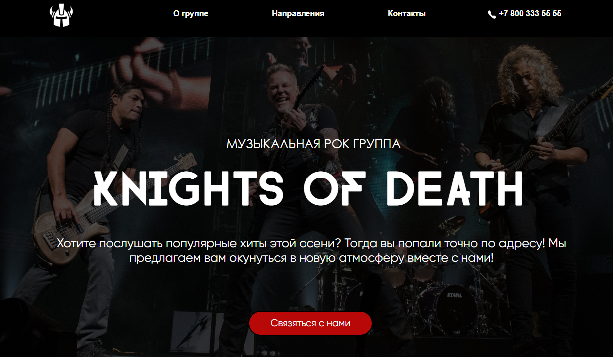

<h1 align="center">Сайт-визитка музыальной группы</h1>

## Что использовалось
Данный проект был реализован на HTML, CSS, SASS, JS.

## Проблемы, с которыми пришлось столкнуться

На сегодняший момент не реализовано отпавление данных в всплывающем окне с вводом данных. В дальнейшем планируется чтобы введенные пользователем данные были отправлены на почтовый ящик группы. 

Также планируется реализация по добавлению новых комментариев.

## Как скачать проект на свою локалную машину

Можно через скачивание zip-папки, либо через git.

Для начала необходимо скачать git https://git-scm.com/downloads. Далее провести необходимую настройку описанную в документации. После проведенных манипуляция, на рабочем столе целкаем правой кнопкой мыши и выбираем git bash here. В открывшейся консоли набираем команду "git clone https://github.com/dron-olya7/groupmusic" и скаченную папку открываем в той среде разработки которой вы пользуетесь.
